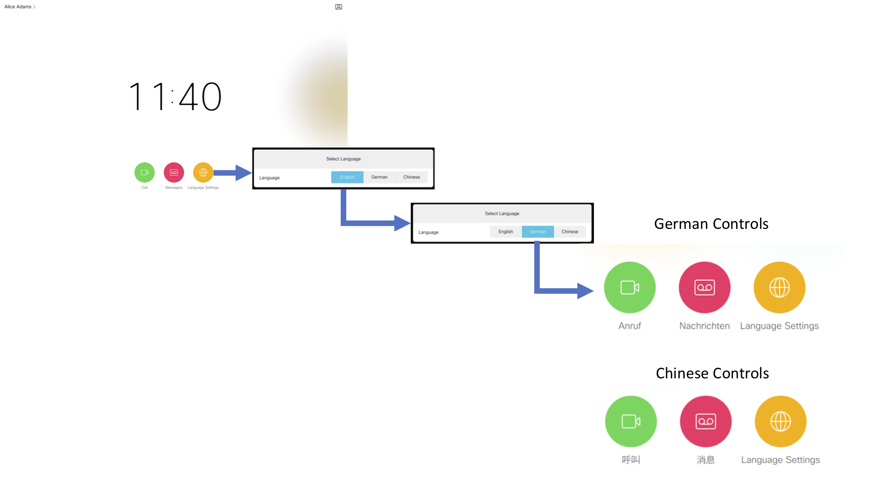
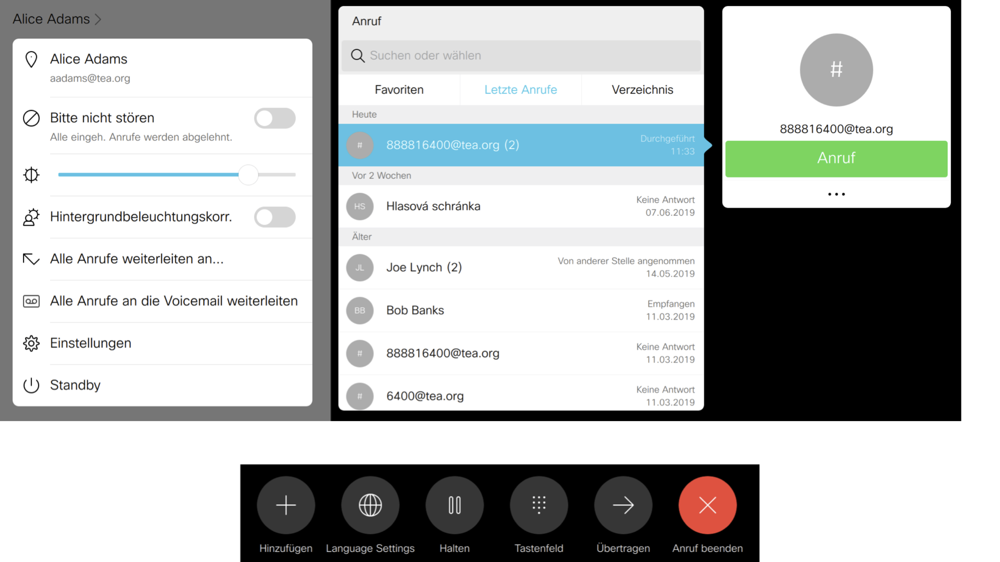
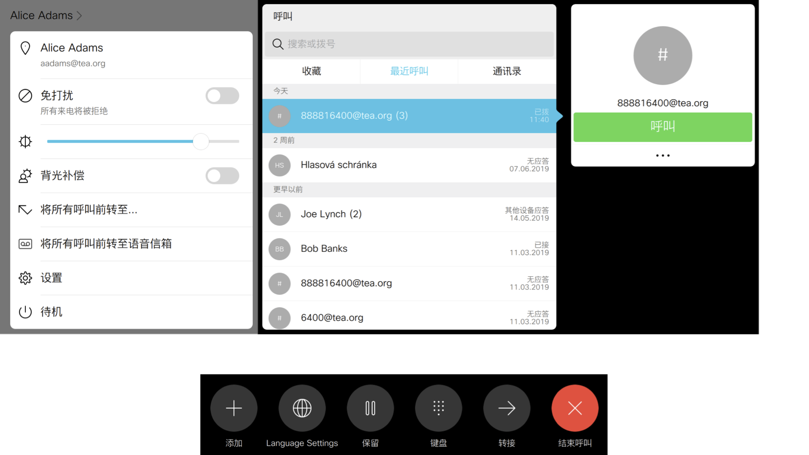

# Cisco Codec Language Settings

*Language Settings Widget for Cisco Video Codecs*

## Motivation

Although language selection is available in **Settings** panel on Cisco video codecs, it may be difficult to find and navigate for ordinary users. This widget and macro has been created to simplify the language selection process and to reset the language to a default one after a call is completed (imagine for example that someone sets the language to Arabic and you need to set it back to English).

## Show Me!

The following picture shows a language selection process from English to German:

Then the whole user interface is switched to German - settings, call controls...:

Same applies to Chinese:

## Features

The widget and macro provide following functions:
- set the codec user interface language from a limited list of languages (in this example it's three)
- reset the language back to default once a call is completed on the codec

## Technologies & Frameworks Used

**Cisco Products & Services:**

- Cisco Video Codec running CE9.x firmware with internal macros and in-room control widgets

**Tools & Frameworks:**

- JavaScript macro framework embedded in the codec
- Written using Atom editor

## Usage

If people like your project, they will want to use it.  Show them how.

## Installation

1. open In-Room Control Editor and upload the widget definition [language-panel.xml](./language-panel.xml) using [=] menu on the right side and **Import from file**.
2. customize the list of languages, you can also increase or decrease the number choices by pressing "Add button" in the language list selection **Properties**
3. verify the widget layout and do **Export to video system**
4. check that you can open the widgets on the Touch10 of the video system
5. open Macro Editor and upload the [language-set.js](./language-set.js) using **Import from file**
6. customize the list of languages in the **const LANGUAGES** (line 7). Full list of languages can be obtained via CLI (SSH to the codec) by entering **xconfiguration UserInterface Language:** and pressing **<TAB>**
7. save and activate the macro

You are now ready to test the widgets. Try tapping the **Language Settings** icon on the home screen, select the language and check if the user interface has changed. Use macro editor console for debugging.

## Authors & Maintainers

Smart people responsible for the creation and maintenance of this project:

- Jaroslav Martan <jmartan@cisco.com>

## Credits

Give proper credit.  Inspired by another project or article?  Was your work made easier by a tutorial?  Include links to the people, projects, and resources that were influential in the creation of this project.

## License

This project is licensed to you under the terms of the [Cisco Sample
Code License](./LICENSE).
